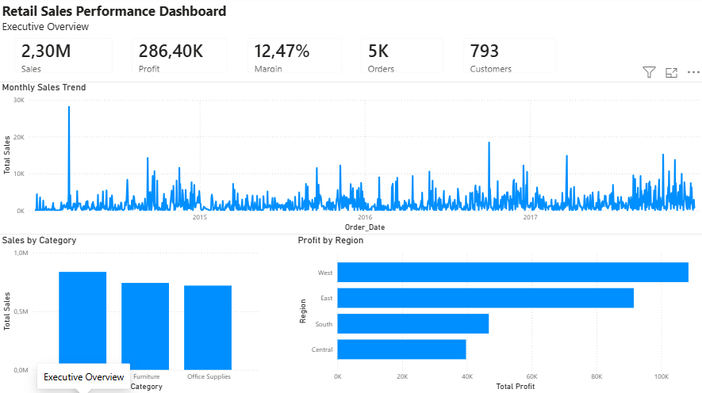
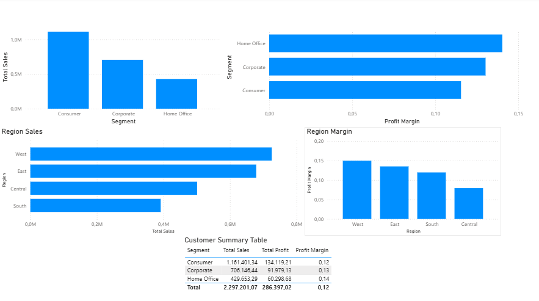
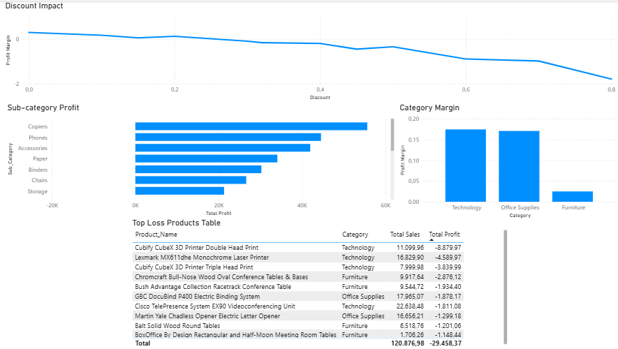

# Retail Sales Performance Analysis

## Project Overview

This project analyzes retail sales data to identify revenue drivers, profitability trends, customer behavior, and areas for business improvement.

The objective was to transform raw transactional data into actionable business insights through data cleaning, SQL analysis, and interactive Power BI dashboards.

---

## Dataset

The analysis was performed using the **Sample Superstore dataset**, containing retail transactions from 2014 to 2017.

Dataset overview:

* **9,994 transactions**
* **5,009 orders**
* **793 customers**
* **1,862 products**
* **21 attributes**

Main fields include:

* Order information
* Customer details
* Product categories
* Sales
* Quantity
* Discount
* Profit

---

## Tools & Technologies

* **Python**

  * Pandas
  * Data profiling
  * Data cleaning
  * Data quality checks

* **SQL Server**

  * Data storage
  * Aggregations
  * Business analysis queries

* **Power BI**

  * Interactive dashboards
  * KPI reporting
  * Data visualization

* **GitHub**

  * Version control
  * Portfolio documentation

---

## Data Preparation

The dataset was analyzed and cleaned using Python.

Performed steps:

* Dataset structure analysis
* Data type validation
* Missing value checks
* Duplicate detection
* Date format conversion
* Data quality validation

Quality checks identified:

* 0 missing values
* 0 duplicate records
* 1,871 transactions with negative profit

Negative profit records were retained because they represent important business cases such as discounts, pricing issues, or loss-making products.

---

## SQL Analysis

The cleaned dataset was loaded into SQL Server and analyzed using SQL queries.

Analysis included:

* Overall sales and profitability KPIs
* Category performance
* Customer segment analysis
* Regional performance
* Monthly sales trends
* Discount impact on profitability
* Loss-making products
* Sub-category profitability

---

# Power BI Dashboard

## Executive Overview



This page provides a high-level view of business performance through:

* Total Sales
* Total Profit
* Profit Margin
* Total Orders
* Total Customers
* Monthly Sales Trend
* Sales by Category
* Profit by Region

---

## Customer & Regional Insights



This page focuses on customer segments and regional performance.

Key metrics analyzed:

* Sales by customer segment
* Profit margin by segment
* Regional sales performance
* Regional profitability

---

## Profitability Analysis



This page investigates profitability drivers and risks.

Analysis includes:

* Discount impact on profit margin
* Sub-category profitability
* Category margins
* Bottom 10 loss-making products

---

# Key Business Insights

## Revenue Drivers

* Technology generated the highest sales revenue.
* Consumer customers contributed the largest sales volume.
* West was the strongest performing region.

## Profitability Drivers

* Overall profit margin was approximately **12.47%**.
* Copiers generated the highest profitability among sub-categories.
* Home Office customers achieved the highest profit margin.

## Business Risks Identified

* Furniture showed significantly lower profitability compared to other categories.
* Tables generated substantial losses despite strong sales volume.
* Discounts above 30% were associated with negative profitability.
* Excessive discounting reduced margins and created loss-making transactions.

---

# Recommendations

Based on the analysis:

1. Review discount strategies and limit excessive discounting.
2. Investigate loss-making products and evaluate pricing decisions.
3. Optimize Furniture category profitability.
4. Focus on high-margin products and customer segments.
5. Monitor profitability alongside revenue growth.

---

## Project Structure

```
retail-sales-performance-analysis/

├── data/
├── python/
│   ├── 01_data_profiling.py
│   └── 02_data_cleaning.py
├── sql/
│   └── 01_sales_analysis.sql
├── powerbi/
│   └── retail_sales_performance_dashboard.pbix
├── images/
└── README.md
```